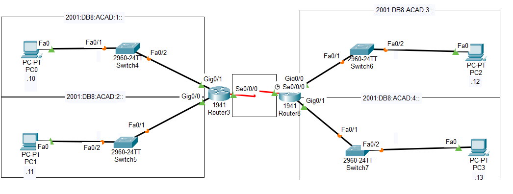

# 👋 Hugo Zamora

🎓 Étudiant en informatique spécialisé en réseaux et systèmes.

Passionné par l'administration système, les infrastructures réseau et la virtualisation.  
Je développe mes compétences à travers des projets pratiques et des laboratoires techniques.

---

# 🧠 Compétences

### Systèmes
- Linux
- Windows Server
- Active Directory

### Réseaux
- TCP/IP
- VLAN
- Routage

### Outils
- Cisco Packet Tracer
- VirtualBox
- GLPI
- Git

---

# 🚀 Projets

## 🔧 Lab Réseau Cisco

Simulation d'une infrastructure réseau avec VLAN et routage.

Technologies utilisées :
- Cisco Packet Tracer
- VLAN
- Routing

---

## 🖥️ Serveur GLPI

Installation et configuration d'un serveur de gestion de parc informatique.

Fonctionnalités :
- Gestion d'inventaire
- Gestion des tickets
- Administration des utilisateurs

---

# 🛠️ Outils utilisés

- Linux
- Git
- VirtualBox
- Cisco Packet Tracer

---

# 📫 Contact

Email : tonemail@email.com  
LinkedIn : ton lien  
GitHub : https://github.com/tonpseudo
